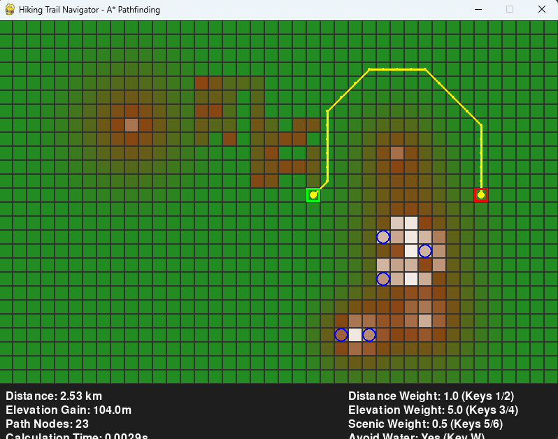

# Hiking Trail Navigator - A* Pathfinding

This project simulates a hiking trail navigator that finds the optimal path across a terrain using the A* pathfinding algorithm. It visualizes the computed path on a 2D elevation grid using Pygame.

## 🌄 Features

- A* pathfinding algorithm implementation
- Terrain modeled as a grid with elevation costs
- Real-time visual feedback using Pygame
- Customizable start and end points
- Highlighted shortest path based on elevation and movement cost

## 🚀 How It Works

- The terrain is represented as a 2D grid where each cell has an elevation value.
- The A* pathfinding algorithm computes the optimal route from the **start** node to the **goal** node.
- Each move considers:
  - Elevation difference (higher elevation adds to the cost)
  - Straight or diagonal movement (diagonal is costlier)
- Pygame is used to render:
  - Terrain with different colors representing elevation
  - Start and end points
  - Shortest path calculated by A*

> The result is a visual map where you can see the terrain and the most efficient hiking path based on the elevation and distance.

---

## 🖼️ UI Screenshot




## 🖥️ Running the Project

Ensure you have pygame installed using:

```bash
pip install -r requirements.txt

Then run the main script:
```bash
python main.py


## 🎥 Demo Video

<video width="100%" height="auto" controls>
  <source src="Demo.mp4" type="video/mp4">
  Your browser does not support the video tag.
</video>

---


